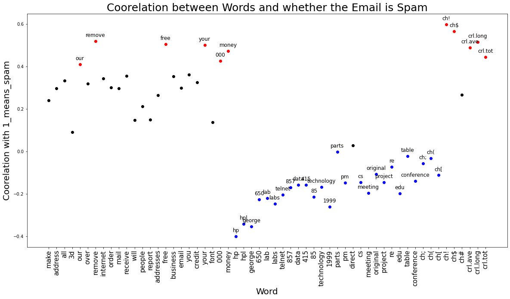
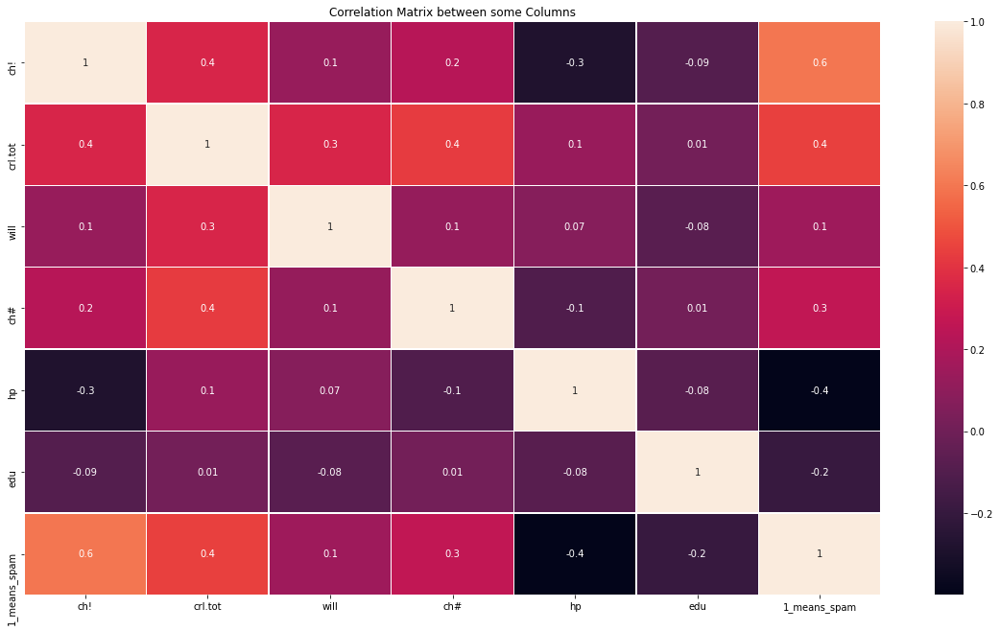
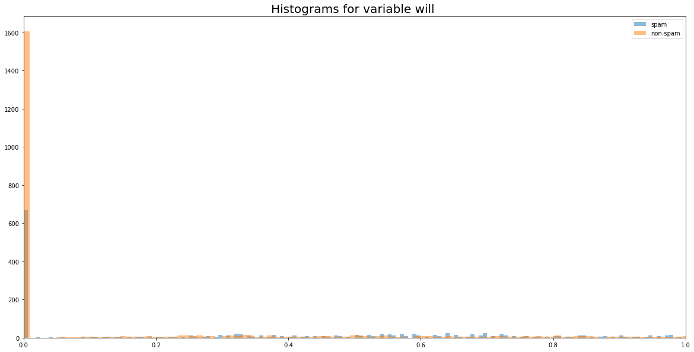
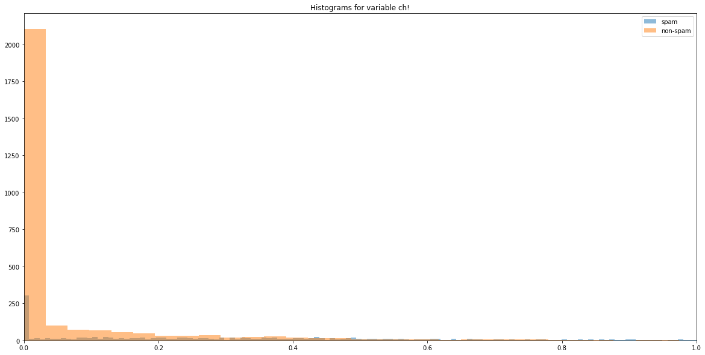
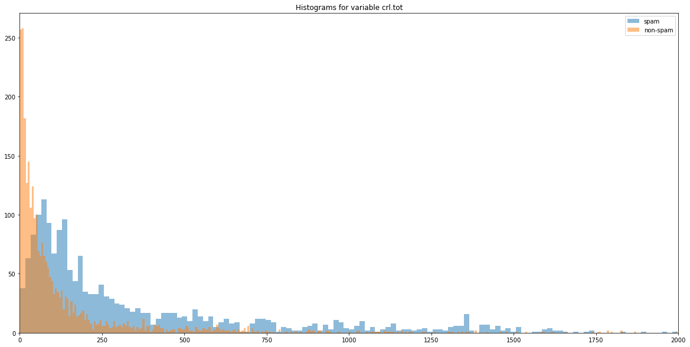
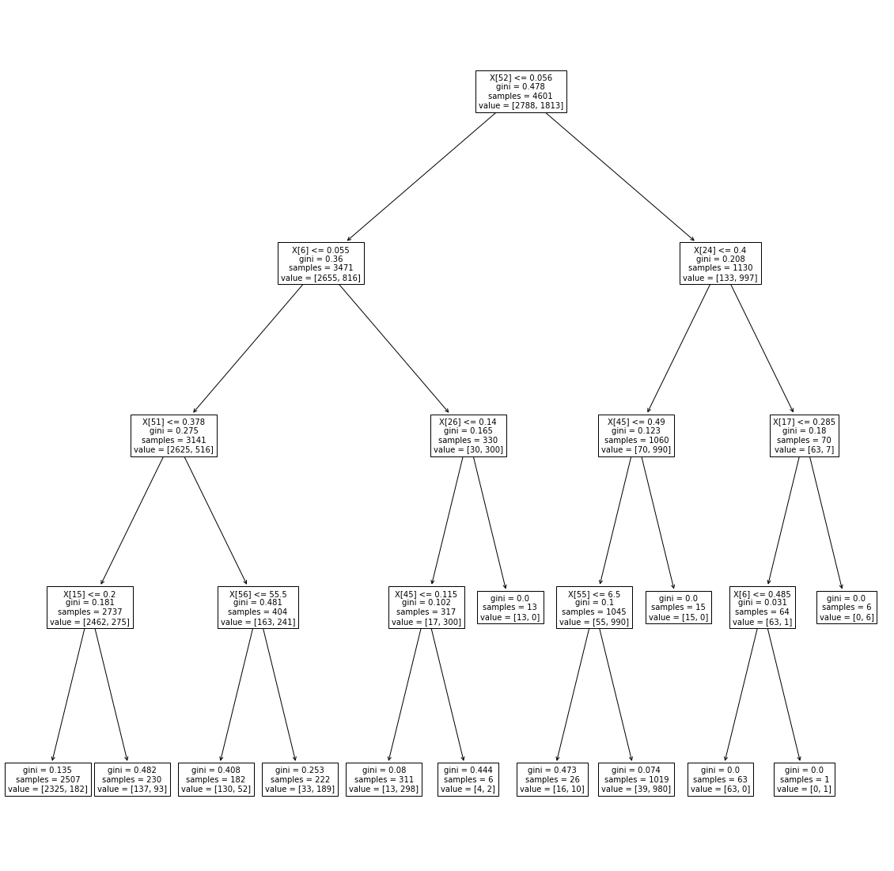
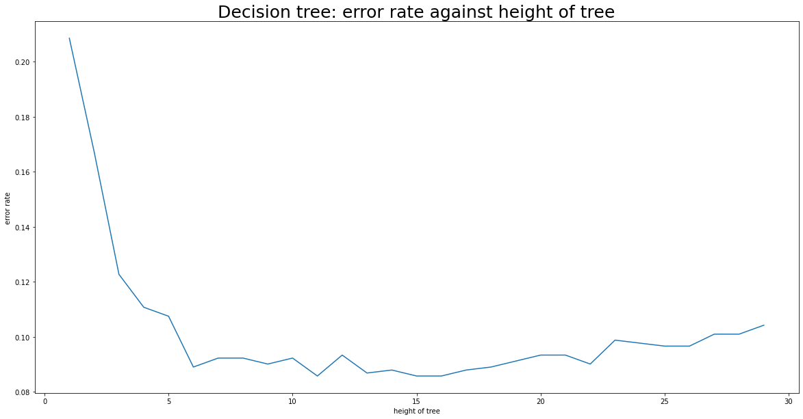
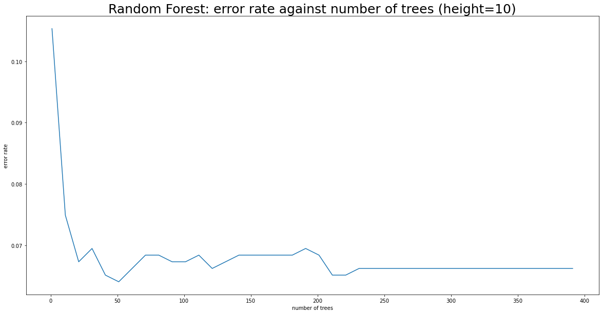
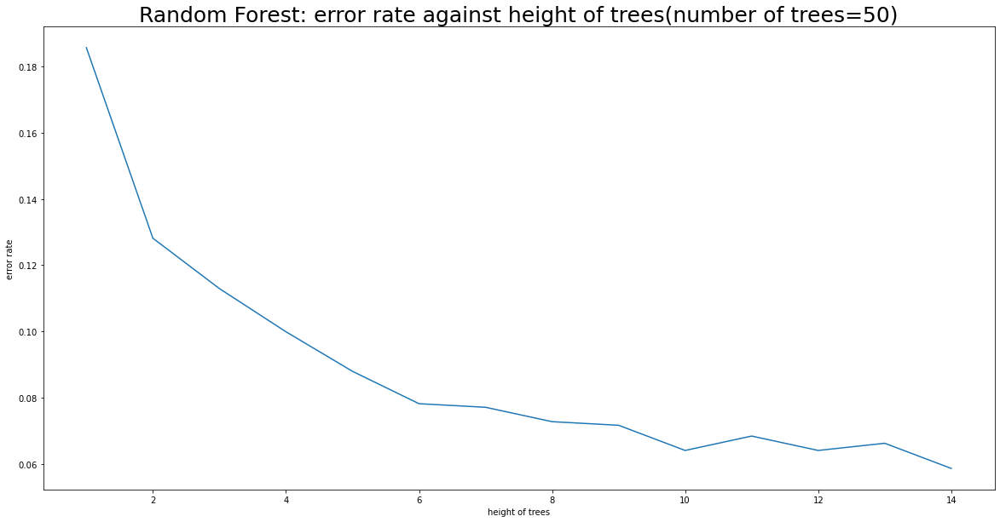
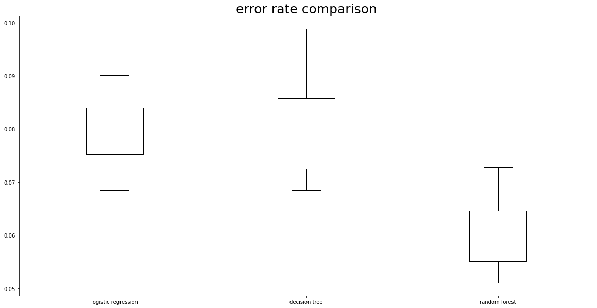

# Data Science Pipline Tutorial
Zhenyu Yue, Kaicheng Wang

## 1. Introduction
Using machine learning to distinguish which emails are spam is a very common example mentioned in many courses and textbooks, but what only very few of them discuss what exactly steps should be taken to do it. Thus, in this tutorial, we hope that you can follow our steps and learn how to "teach" your computer to distinguish spam emails based on existing training sets.

## 2. Set Up
Below are packages needed for this tutorial.

pandas is a useful package to manage data, a lot of people use pandas dataframe to store and play with their data in a program. If you are not familiar with pandas, here is its [tutorial](https://pandas.pydata.org/docs/getting_started/index.html), and if you want a more detailed introduction, this [video](https://www.youtube.com/watch?v=ZyhVh-qRZPA) may be helpful. 

numpy is a even more useful package to do math in python. If you are not familar with numpy [this](https://numpy.org/install/) is a good start point.

matplotlib is a package to produce useful and beautiful graphs, it collaborates well with Series and Dataframe in pandas and arrays in numpy. If you are interested in data visualization, [here](https://matplotlib.org/stable/tutorials/index.html) is where you can start.

sklearn is a package for machine learning, and you can find almost all of the common machine learning models in it. In this tutorial, we use logistic regression, decision tree and random forest in sklearn. If you want to know more about the package, please visit [sklearn's website](https://scikit-learn.org/stable/getting_started.html)

statsmodels have similar function as sklearn, but it allows us to do hypothesis testing more easily. We use statsmodel to do a hypothesis test on the coefficients of the logistic regression in this tutorial, and if you want to know more, you can visit [statsmodel's website](https://www.statsmodels.org/stable/index.html). Note that you need to import numpy if you want to use statsmodel.

Seaborn is a package similar to matplotlib for data visualization. We use it to produce some fancy heat map in this tutorial. Similarly, you can visit its [website](https://seaborn.pydata.org/introduction.html) for more details.


```python
import pandas as pd
import numpy as np
import matplotlib.pyplot as plt

from sklearn.linear_model import LogisticRegression
from sklearn.model_selection import train_test_split
from sklearn import tree
from sklearn.ensemble import RandomForestClassifier
from sklearn import svm
from sklearn.model_selection import ShuffleSplit
from sklearn.model_selection import cross_val_score
from sklearn.preprocessing import StandardScaler

import statsmodels.api as sm

from scipy import stats

import seaborn as sns
```

## 3. Data description

The data comes from UC Irvine, and here is the [link](archive.ics.uci.edu/ml/datasets/Spambase). Note that there are 2 files in the link. Most of the data are in the file called "spambase.data" while the other file contains the column information for the table. As you can see below, in this tutorial, we input the column names by hand. Also, thanks to UC Irvine, they provide nice data without missing values or messy formats, but if you unfortunately have some data with missing values or strange formats (which is quite common) pandas have various function that can help you solve the problem. Personally, I think apply() is a nice one, and here are some [tutorial](https://pandas.pydata.org/docs/reference/api/pandas.DataFrame.apply.html) for it.

Note: If you are going to use the same code as we did to import data, please make sure spambase.data are in the same directory with your python script or Jupyter Notebook.


```python
data =  pd.read_csv('spambase.data',header=None)
data.columns = [ 'make', 'address', 'all', '3d', 'our', 'over', 'remove', 'internet', 'order', 'mail', 'receive', 'will', 'people', 'report', 'addresses', 'free', 'business', 'email', 'you', 'credit', 'your', 'font', '000', 'money', 'hp', 'hpl', 'george', '650', 'lab', 'labs', 'telnet', '857', 'data', '415', '85', 'technology', '1999', 'parts', 'pm', 'direct', 'cs', 'meeting', 'original', 'project', 're', 'edu', 'table', 'conference', 'ch;', 'ch(', 'ch[', 'ch!', 'ch$', 'ch#', 'crl.ave', 'crl.long', 'crl.tot','1_means_spam']
data
# crl.ave means average length of not understandable capital letter word
# crl.long means longest length of not understandable capitcal letter word
# crl.tot means total length of not understandable capitcal letter word
```


<div>
<style scoped>
    .dataframe tbody tr th:only-of-type {
        vertical-align: middle;
    }

    .dataframe tbody tr th {
        vertical-align: top;
    }

    .dataframe thead th {
        text-align: right;
    }
</style>
<table border="1" class="dataframe">
  <thead>
    <tr style="text-align: right;">
      <th></th>
      <th>make</th>
      <th>address</th>
      <th>all</th>
      <th>3d</th>
      <th>our</th>
      <th>over</th>
      <th>remove</th>
      <th>internet</th>
      <th>order</th>
      <th>mail</th>
      <th>...</th>
      <th>ch;</th>
      <th>ch(</th>
      <th>ch[</th>
      <th>ch!</th>
      <th>ch$</th>
      <th>ch#</th>
      <th>crl.ave</th>
      <th>crl.long</th>
      <th>crl.tot</th>
      <th>1_means_spam</th>
    </tr>
  </thead>
  <tbody>
    <tr>
      <th>0</th>
      <td>0.00</td>
      <td>0.64</td>
      <td>0.64</td>
      <td>0.0</td>
      <td>0.32</td>
      <td>0.00</td>
      <td>0.00</td>
      <td>0.00</td>
      <td>0.00</td>
      <td>0.00</td>
      <td>...</td>
      <td>0.000</td>
      <td>0.000</td>
      <td>0.0</td>
      <td>0.778</td>
      <td>0.000</td>
      <td>0.000</td>
      <td>3.756</td>
      <td>61</td>
      <td>278</td>
      <td>1</td>
    </tr>
    <tr>
      <th>1</th>
      <td>0.21</td>
      <td>0.28</td>
      <td>0.50</td>
      <td>0.0</td>
      <td>0.14</td>
      <td>0.28</td>
      <td>0.21</td>
      <td>0.07</td>
      <td>0.00</td>
      <td>0.94</td>
      <td>...</td>
      <td>0.000</td>
      <td>0.132</td>
      <td>0.0</td>
      <td>0.372</td>
      <td>0.180</td>
      <td>0.048</td>
      <td>5.114</td>
      <td>101</td>
      <td>1028</td>
      <td>1</td>
    </tr>
    <tr>
      <th>2</th>
      <td>0.06</td>
      <td>0.00</td>
      <td>0.71</td>
      <td>0.0</td>
      <td>1.23</td>
      <td>0.19</td>
      <td>0.19</td>
      <td>0.12</td>
      <td>0.64</td>
      <td>0.25</td>
      <td>...</td>
      <td>0.010</td>
      <td>0.143</td>
      <td>0.0</td>
      <td>0.276</td>
      <td>0.184</td>
      <td>0.010</td>
      <td>9.821</td>
      <td>485</td>
      <td>2259</td>
      <td>1</td>
    </tr>
    <tr>
      <th>3</th>
      <td>0.00</td>
      <td>0.00</td>
      <td>0.00</td>
      <td>0.0</td>
      <td>0.63</td>
      <td>0.00</td>
      <td>0.31</td>
      <td>0.63</td>
      <td>0.31</td>
      <td>0.63</td>
      <td>...</td>
      <td>0.000</td>
      <td>0.137</td>
      <td>0.0</td>
      <td>0.137</td>
      <td>0.000</td>
      <td>0.000</td>
      <td>3.537</td>
      <td>40</td>
      <td>191</td>
      <td>1</td>
    </tr>
    <tr>
      <th>4</th>
      <td>0.00</td>
      <td>0.00</td>
      <td>0.00</td>
      <td>0.0</td>
      <td>0.63</td>
      <td>0.00</td>
      <td>0.31</td>
      <td>0.63</td>
      <td>0.31</td>
      <td>0.63</td>
      <td>...</td>
      <td>0.000</td>
      <td>0.135</td>
      <td>0.0</td>
      <td>0.135</td>
      <td>0.000</td>
      <td>0.000</td>
      <td>3.537</td>
      <td>40</td>
      <td>191</td>
      <td>1</td>
    </tr>
    <tr>
      <th>...</th>
      <td>...</td>
      <td>...</td>
      <td>...</td>
      <td>...</td>
      <td>...</td>
      <td>...</td>
      <td>...</td>
      <td>...</td>
      <td>...</td>
      <td>...</td>
      <td>...</td>
      <td>...</td>
      <td>...</td>
      <td>...</td>
      <td>...</td>
      <td>...</td>
      <td>...</td>
      <td>...</td>
      <td>...</td>
      <td>...</td>
      <td>...</td>
    </tr>
    <tr>
      <th>4596</th>
      <td>0.31</td>
      <td>0.00</td>
      <td>0.62</td>
      <td>0.0</td>
      <td>0.00</td>
      <td>0.31</td>
      <td>0.00</td>
      <td>0.00</td>
      <td>0.00</td>
      <td>0.00</td>
      <td>...</td>
      <td>0.000</td>
      <td>0.232</td>
      <td>0.0</td>
      <td>0.000</td>
      <td>0.000</td>
      <td>0.000</td>
      <td>1.142</td>
      <td>3</td>
      <td>88</td>
      <td>0</td>
    </tr>
    <tr>
      <th>4597</th>
      <td>0.00</td>
      <td>0.00</td>
      <td>0.00</td>
      <td>0.0</td>
      <td>0.00</td>
      <td>0.00</td>
      <td>0.00</td>
      <td>0.00</td>
      <td>0.00</td>
      <td>0.00</td>
      <td>...</td>
      <td>0.000</td>
      <td>0.000</td>
      <td>0.0</td>
      <td>0.353</td>
      <td>0.000</td>
      <td>0.000</td>
      <td>1.555</td>
      <td>4</td>
      <td>14</td>
      <td>0</td>
    </tr>
    <tr>
      <th>4598</th>
      <td>0.30</td>
      <td>0.00</td>
      <td>0.30</td>
      <td>0.0</td>
      <td>0.00</td>
      <td>0.00</td>
      <td>0.00</td>
      <td>0.00</td>
      <td>0.00</td>
      <td>0.00</td>
      <td>...</td>
      <td>0.102</td>
      <td>0.718</td>
      <td>0.0</td>
      <td>0.000</td>
      <td>0.000</td>
      <td>0.000</td>
      <td>1.404</td>
      <td>6</td>
      <td>118</td>
      <td>0</td>
    </tr>
    <tr>
      <th>4599</th>
      <td>0.96</td>
      <td>0.00</td>
      <td>0.00</td>
      <td>0.0</td>
      <td>0.32</td>
      <td>0.00</td>
      <td>0.00</td>
      <td>0.00</td>
      <td>0.00</td>
      <td>0.00</td>
      <td>...</td>
      <td>0.000</td>
      <td>0.057</td>
      <td>0.0</td>
      <td>0.000</td>
      <td>0.000</td>
      <td>0.000</td>
      <td>1.147</td>
      <td>5</td>
      <td>78</td>
      <td>0</td>
    </tr>
    <tr>
      <th>4600</th>
      <td>0.00</td>
      <td>0.00</td>
      <td>0.65</td>
      <td>0.0</td>
      <td>0.00</td>
      <td>0.00</td>
      <td>0.00</td>
      <td>0.00</td>
      <td>0.00</td>
      <td>0.00</td>
      <td>...</td>
      <td>0.000</td>
      <td>0.000</td>
      <td>0.0</td>
      <td>0.125</td>
      <td>0.000</td>
      <td>0.000</td>
      <td>1.250</td>
      <td>5</td>
      <td>40</td>
      <td>0</td>
    </tr>
  </tbody>
</table>
<p>4601 rows × 58 columns</p>
</div>


48 continuous real [0,100] attributes of type word_freq_WORD (e.g make, address...)
= percentage of words in the e-mail that match WORD, i.e. 100 * (number of times the WORD appears in the e-mail) / total number of words in e-mail. A "word" in this case is any string of alphanumeric characters bounded by non-alphanumeric characters or end-of-string.

6 continuous real [0,100] attributes of type char_freq_CHAR (e.g 'ch;', 'ch(' )
= percentage of characters in the e-mail that match CHAR, i.e. 100 * (number of CHAR occurences) / total characters in e-mail

1 continuous real [1,...] attribute of type capital_run_length_average
= average length of uninterrupted sequences of capital letters

1 continuous integer [1,...] attribute of type capital_run_length_longest
= length of longest uninterrupted sequence of capital letters

1 continuous integer [1,...] attribute of type capital_run_length_total
= sum of length of uninterrupted sequences of capital letters
= total number of capital letters in the e-mail

1 nominal {0,1} class attribute of type spam
= denotes whether the e-mail was considered spam (1) or not (0), i.e. unsolicited commercial e-mail.

## 3. Exploratory Data Analysis

### 3.1. Calculating basic statistics
The dataset is first split into two groups based on whether they are spam or not. The mean of all independent variables are calculated within each group.


```python
df_spam = data[data["1_means_spam"]==1].drop("1_means_spam",axis=1)
df_no = data[data["1_means_spam"]==0].drop("1_means_spam",axis=1)
df_no_mean = pd.DataFrame(df_no.mean(),columns = {"non-spam_mean"})
df_spam_mean = pd.DataFrame(df_spam.mean(),columns = {"spam_mean"})
df_mean = df_no_mean.join(df_spam_mean,how="outer").reset_index()
df_mean.append({"index":"total_count","non-spam_mean":2788,"spam_mean":1813},ignore_index = True)
```


<div>
<style scoped>
    .dataframe tbody tr th:only-of-type {
        vertical-align: middle;
    }

    .dataframe tbody tr th {
        vertical-align: top;
    }

    .dataframe thead th {
        text-align: right;
    }
</style>
<table border="1" class="dataframe">
  <thead>
    <tr style="text-align: right;">
      <th></th>
      <th>index</th>
      <th>non-spam_mean</th>
      <th>spam_mean</th>
    </tr>
  </thead>
  <tbody>
    <tr>
      <th>0</th>
      <td>make</td>
      <td>0.073479</td>
      <td>0.152339</td>
    </tr>
    <tr>
      <th>1</th>
      <td>address</td>
      <td>0.244466</td>
      <td>0.164650</td>
    </tr>
    <tr>
      <th>2</th>
      <td>all</td>
      <td>0.200581</td>
      <td>0.403795</td>
    </tr>
    <tr>
      <th>3</th>
      <td>3d</td>
      <td>0.000886</td>
      <td>0.164672</td>
    </tr>
    <tr>
      <th>4</th>
      <td>our</td>
      <td>0.181040</td>
      <td>0.513955</td>
    </tr>
    <tr>
      <th>5</th>
      <td>over</td>
      <td>0.044544</td>
      <td>0.174876</td>
    </tr>
    <tr>
      <th>6</th>
      <td>remove</td>
      <td>0.009383</td>
      <td>0.275405</td>
    </tr>
    <tr>
      <th>7</th>
      <td>internet</td>
      <td>0.038415</td>
      <td>0.208141</td>
    </tr>
    <tr>
      <th>8</th>
      <td>order</td>
      <td>0.038049</td>
      <td>0.170061</td>
    </tr>
    <tr>
      <th>9</th>
      <td>mail</td>
      <td>0.167170</td>
      <td>0.350507</td>
    </tr>
    <tr>
      <th>10</th>
      <td>receive</td>
      <td>0.021711</td>
      <td>0.118434</td>
    </tr>
    <tr>
      <th>11</th>
      <td>will</td>
      <td>0.536324</td>
      <td>0.549972</td>
    </tr>
    <tr>
      <th>12</th>
      <td>people</td>
      <td>0.061664</td>
      <td>0.143547</td>
    </tr>
    <tr>
      <th>13</th>
      <td>report</td>
      <td>0.042403</td>
      <td>0.083574</td>
    </tr>
    <tr>
      <th>14</th>
      <td>addresses</td>
      <td>0.008318</td>
      <td>0.112079</td>
    </tr>
    <tr>
      <th>15</th>
      <td>free</td>
      <td>0.073587</td>
      <td>0.518362</td>
    </tr>
    <tr>
      <th>16</th>
      <td>business</td>
      <td>0.048346</td>
      <td>0.287507</td>
    </tr>
    <tr>
      <th>17</th>
      <td>email</td>
      <td>0.097292</td>
      <td>0.319228</td>
    </tr>
    <tr>
      <th>18</th>
      <td>you</td>
      <td>1.270341</td>
      <td>2.264539</td>
    </tr>
    <tr>
      <th>19</th>
      <td>credit</td>
      <td>0.007579</td>
      <td>0.205521</td>
    </tr>
    <tr>
      <th>20</th>
      <td>your</td>
      <td>0.438702</td>
      <td>1.380370</td>
    </tr>
    <tr>
      <th>21</th>
      <td>font</td>
      <td>0.045226</td>
      <td>0.238036</td>
    </tr>
    <tr>
      <th>22</th>
      <td>000</td>
      <td>0.007088</td>
      <td>0.247055</td>
    </tr>
    <tr>
      <th>23</th>
      <td>money</td>
      <td>0.017138</td>
      <td>0.212879</td>
    </tr>
    <tr>
      <th>24</th>
      <td>hp</td>
      <td>0.895473</td>
      <td>0.017479</td>
    </tr>
    <tr>
      <th>25</th>
      <td>hpl</td>
      <td>0.431994</td>
      <td>0.009173</td>
    </tr>
    <tr>
      <th>26</th>
      <td>george</td>
      <td>1.265265</td>
      <td>0.001550</td>
    </tr>
    <tr>
      <th>27</th>
      <td>650</td>
      <td>0.193806</td>
      <td>0.018798</td>
    </tr>
    <tr>
      <th>28</th>
      <td>lab</td>
      <td>0.162794</td>
      <td>0.000684</td>
    </tr>
    <tr>
      <th>29</th>
      <td>labs</td>
      <td>0.165854</td>
      <td>0.005968</td>
    </tr>
    <tr>
      <th>30</th>
      <td>telnet</td>
      <td>0.106033</td>
      <td>0.001274</td>
    </tr>
    <tr>
      <th>31</th>
      <td>857</td>
      <td>0.077306</td>
      <td>0.000518</td>
    </tr>
    <tr>
      <th>32</th>
      <td>data</td>
      <td>0.150986</td>
      <td>0.014562</td>
    </tr>
    <tr>
      <th>33</th>
      <td>415</td>
      <td>0.077787</td>
      <td>0.001776</td>
    </tr>
    <tr>
      <th>34</th>
      <td>85</td>
      <td>0.169455</td>
      <td>0.006928</td>
    </tr>
    <tr>
      <th>35</th>
      <td>technology</td>
      <td>0.141671</td>
      <td>0.029515</td>
    </tr>
    <tr>
      <th>36</th>
      <td>1999</td>
      <td>0.197744</td>
      <td>0.043469</td>
    </tr>
    <tr>
      <th>37</th>
      <td>parts</td>
      <td>0.018723</td>
      <td>0.004710</td>
    </tr>
    <tr>
      <th>38</th>
      <td>pm</td>
      <td>0.121679</td>
      <td>0.012427</td>
    </tr>
    <tr>
      <th>39</th>
      <td>direct</td>
      <td>0.083117</td>
      <td>0.036718</td>
    </tr>
    <tr>
      <th>40</th>
      <td>cs</td>
      <td>0.072027</td>
      <td>0.000055</td>
    </tr>
    <tr>
      <th>41</th>
      <td>meeting</td>
      <td>0.216808</td>
      <td>0.002443</td>
    </tr>
    <tr>
      <th>42</th>
      <td>original</td>
      <td>0.070581</td>
      <td>0.008450</td>
    </tr>
    <tr>
      <th>43</th>
      <td>project</td>
      <td>0.126636</td>
      <td>0.006244</td>
    </tr>
    <tr>
      <th>44</th>
      <td>re</td>
      <td>0.415760</td>
      <td>0.125091</td>
    </tr>
    <tr>
      <th>45</th>
      <td>edu</td>
      <td>0.287184</td>
      <td>0.014727</td>
    </tr>
    <tr>
      <th>46</th>
      <td>table</td>
      <td>0.008192</td>
      <td>0.001219</td>
    </tr>
    <tr>
      <th>47</th>
      <td>conference</td>
      <td>0.051227</td>
      <td>0.002101</td>
    </tr>
    <tr>
      <th>48</th>
      <td>ch;</td>
      <td>0.050281</td>
      <td>0.020573</td>
    </tr>
    <tr>
      <th>49</th>
      <td>ch(</td>
      <td>0.158578</td>
      <td>0.108970</td>
    </tr>
    <tr>
      <th>50</th>
      <td>ch[</td>
      <td>0.022684</td>
      <td>0.008199</td>
    </tr>
    <tr>
      <th>51</th>
      <td>ch!</td>
      <td>0.109984</td>
      <td>0.513713</td>
    </tr>
    <tr>
      <th>52</th>
      <td>ch$</td>
      <td>0.011648</td>
      <td>0.174478</td>
    </tr>
    <tr>
      <th>53</th>
      <td>ch#</td>
      <td>0.021713</td>
      <td>0.078877</td>
    </tr>
    <tr>
      <th>54</th>
      <td>crl.ave</td>
      <td>2.377301</td>
      <td>9.519165</td>
    </tr>
    <tr>
      <th>55</th>
      <td>crl.long</td>
      <td>18.214491</td>
      <td>104.393271</td>
    </tr>
    <tr>
      <th>56</th>
      <td>crl.tot</td>
      <td>161.470947</td>
      <td>470.619415</td>
    </tr>
    <tr>
      <th>57</th>
      <td>total_count</td>
      <td>2788.000000</td>
      <td>1813.000000</td>
    </tr>
  </tbody>
</table>
</div>


### 3.2. Correlation
#### Coorelation Graph


```python
plt.subplots(figsize = (20,10))

corr_about_spam=data.corr("spearman")['1_means_spam']

corr_about_spam=corr_about_spam.drop('1_means_spam')


for index, value in corr_about_spam.iteritems():
    
    if value>0.4:
        plt.scatter(index,value,color='red')
        plt.annotate(index, # this is the text
                 (index,value),fontsize=12, # this is the point to label
                 textcoords="offset points", # how to position the text
                 xytext=(0,10), # distance from text to points (x,y)
                 ha='center')
    elif value < 0:
        plt.scatter(index,value,color='blue')
        
        plt.annotate(index, # this is the text
                 (index,value),fontsize=12, # this is the point to label
                 textcoords="offset points", # how to position the text
                 xytext=(0,10), # distance from text to points (x,y)
                 ha='center')
    else:
        plt.scatter(index,value,color='black')
plt.title("Coorelation between Words and whether the Email is Spam", fontsize=25)      
plt.xticks(rotation = 90)
plt.xticks(fontsize = 15)
plt.xlabel('Word', fontsize=20)
plt.ylabel('Coorelation with 1_means_spam', fontsize=20)
plt.show()
```


    

    


#### Coorelation Matrix

Here we show the correlation matrix of some rows. We do not choose to show the whole correlation matrix since it is too large. In the following matrix, we pick 2 columns with moderate positive correlation with spam, 2 columns with weak positive correlation with spam, and 2 columns with negative coorelation.


```python
corr_matrix=data.corr('spearman')

plot_table=corr_matrix.loc[['ch!','crl.tot','will','ch#','hp','edu','1_means_spam'],
                           ['ch!','crl.tot','will','ch#','hp','edu','1_means_spam']]

plt.subplots(figsize = (20,11))

g = sns.heatmap(plot_table, annot = True, fmt = '.1g', linewidths=.5,)
g.set_title("Correlation Matrix between some Columns")
g

```


    <AxesSubplot:title={'center':'Correlation Matrix between some Columns'}>


    

    


### 3.3. Data Visualization
The distribution of three variables are displayed. The first variable is "will" word frequency, the second is "!" character frequency, the third is the total length of uninterrupted sequence of capital letters. These three variables are chosen since they represent the three types of indepdendent variables in the dataset.


```python
plt.subplots(figsize = (20,10))
plt.hist(df_spam["will"], bins=1000, alpha=0.5, label="spam")
plt.hist(df_no["will"], bins=1000, alpha=0.5, label="non-spam")
plt.title("Histograms for variable will ",size=20)
plt.xlim([0,1])
plt.legend(loc='upper right')
```


    <matplotlib.legend.Legend at 0x7f80f8710e20>


    

    


```python
plt.subplots(figsize = (20,10))
plt.hist(df_spam["ch!"], bins=1000, alpha=0.5, label="spam")
plt.hist(df_no["ch!"], bins=1000, alpha=0.5, label="non-spam")
plt.title("Histograms for variable ch!")
plt.xlim([0,1])
plt.legend(loc='upper right')
```


    <matplotlib.legend.Legend at 0x7f810dd00d60>


    

    


```python
plt.subplots(figsize = (20,10))
plt.hist(df_spam["crl.tot"], bins=1000, alpha=0.5, label="spam")
plt.hist(df_no["crl.tot"], bins=1000, alpha=0.5, label="non-spam")
plt.title("Histograms for variable crl.tot")
plt.xlim([0,2000])
plt.legend(loc='upper right')
```


    <matplotlib.legend.Legend at 0x7f810d9a7c10>


    

    


Observations:

The histogram graphs of "will" and "ch!" are almost impossible to read. The reason is that word frequencies are 0 for many emails, this can not be solved by zoom-in or rescaling of variables. Trying to understand this kind of large dataset by simple visualization method is almost impossible.

For the variable "crl.tot", the graph is more readable. It can be seen that spam mails tend to contain more capital letters. This observation coincides with the correlation graph, which also suggests a positive correlation between total capital letters and spam risk.

### 3.4. hypothesis testing and regression
We only look at the independent variable with the highest correlation with spam.


```python
logistic_reg_data=data[['ch!','1_means_spam']]
Xtrain = logistic_reg_data['ch!']
Xtrain = sm.add_constant(Xtrain)
ytrain = logistic_reg_data['1_means_spam']
log_reg = sm.Logit(ytrain, Xtrain).fit()

log_reg.summary()
```

    Optimization terminated successfully.
             Current function value: 0.594183
             Iterations 7


<table class="simpletable">
<caption>Logit Regression Results</caption>
<tr>
  <th>Dep. Variable:</th>     <td>1_means_spam</td>   <th>  No. Observations:  </th>   <td>  4601</td>  
</tr>
<tr>
  <th>Model:</th>                 <td>Logit</td>      <th>  Df Residuals:      </th>   <td>  4599</td>  
</tr>
<tr>
  <th>Method:</th>                 <td>MLE</td>       <th>  Df Model:          </th>   <td>     1</td>  
</tr>
<tr>
  <th>Date:</th>            <td>Thu, 13 May 2021</td> <th>  Pseudo R-squ.:     </th>   <td>0.1139</td>  
</tr>
<tr>
  <th>Time:</th>                <td>14:46:04</td>     <th>  Log-Likelihood:    </th>  <td> -2733.8</td> 
</tr>
<tr>
  <th>converged:</th>             <td>True</td>       <th>  LL-Null:           </th>  <td> -3085.1</td> 
</tr>
<tr>
  <th>Covariance Type:</th>     <td>nonrobust</td>    <th>  LLR p-value:       </th> <td>8.622e-155</td>
</tr>
</table>
<table class="simpletable">
<tr>
    <td></td>       <th>coef</th>     <th>std err</th>      <th>z</th>      <th>P>|z|</th>  <th>[0.025</th>    <th>0.975]</th>  
</tr>
<tr>
  <th>const</th> <td>   -0.9618</td> <td>    0.039</td> <td>  -24.705</td> <td> 0.000</td> <td>   -1.038</td> <td>   -0.885</td>
</tr>
<tr>
  <th>ch!</th>   <td>    2.4452</td> <td>    0.118</td> <td>   20.751</td> <td> 0.000</td> <td>    2.214</td> <td>    2.676</td>
</tr>
</table>


Observation:

The p-value<0.001 shows that there is a statistically significant relationship between the number of "!" and whether an email is spam. The significance level used is 0.05.

## 4. Attribution

In this part, we will use some machine learning models to see the top 5 most influential words (patterns of word) to determine whether an email is a spam or not. In this section, we will try multiple models. You might have question on the reason we pick the parameters in some models, and we will discuss them in the following section.

All of the models uses "1_means_spam" as the dependent variable, and all other columns as the independent variable.


```python
# This funciton is used to suppress warnings in logistic regression since it does not converge, 
# the function does not have any side effects
def warn(*args, **kwargs):
    pass
import warnings
warnings.warn = warn
```

### 4.1. Logistic Regression
The first thing we tried is the logistic regression. We are going to see which words (patterns of words) are more important according to the absolute value of their coefficient in the regression result.


```python
X = sm.add_constant(data.drop("1_means_spam",axis=1))

est = sm.Logit(data["1_means_spam"], X)
est2 = est.fit()
est2.summary()
```

    Optimization terminated successfully.
             Current function value: 0.197323
             Iterations 15


<table class="simpletable">
<caption>Logit Regression Results</caption>
<tr>
  <th>Dep. Variable:</th>     <td>1_means_spam</td>   <th>  No. Observations:  </th>  <td>  4601</td> 
</tr>
<tr>
  <th>Model:</th>                 <td>Logit</td>      <th>  Df Residuals:      </th>  <td>  4543</td> 
</tr>
<tr>
  <th>Method:</th>                 <td>MLE</td>       <th>  Df Model:          </th>  <td>    57</td> 
</tr>
<tr>
  <th>Date:</th>            <td>Thu, 13 May 2021</td> <th>  Pseudo R-squ.:     </th>  <td>0.7057</td> 
</tr>
<tr>
  <th>Time:</th>                <td>14:46:05</td>     <th>  Log-Likelihood:    </th> <td> -907.88</td>
</tr>
<tr>
  <th>converged:</th>             <td>True</td>       <th>  LL-Null:           </th> <td> -3085.1</td>
</tr>
<tr>
  <th>Covariance Type:</th>     <td>nonrobust</td>    <th>  LLR p-value:       </th>  <td> 0.000</td> 
</tr>
</table>
<table class="simpletable">
<tr>
       <td></td>         <th>coef</th>     <th>std err</th>      <th>z</th>      <th>P>|z|</th>  <th>[0.025</th>    <th>0.975]</th>  
</tr>
<tr>
  <th>const</th>      <td>   -1.5686</td> <td>    0.142</td> <td>  -11.044</td> <td> 0.000</td> <td>   -1.847</td> <td>   -1.290</td>
</tr>
<tr>
  <th>make</th>       <td>   -0.3895</td> <td>    0.231</td> <td>   -1.683</td> <td> 0.092</td> <td>   -0.843</td> <td>    0.064</td>
</tr>
<tr>
  <th>address</th>    <td>   -0.1458</td> <td>    0.069</td> <td>   -2.104</td> <td> 0.035</td> <td>   -0.282</td> <td>   -0.010</td>
</tr>
<tr>
  <th>all</th>        <td>    0.1141</td> <td>    0.110</td> <td>    1.035</td> <td> 0.301</td> <td>   -0.102</td> <td>    0.330</td>
</tr>
<tr>
  <th>3d</th>         <td>    2.2515</td> <td>    1.507</td> <td>    1.494</td> <td> 0.135</td> <td>   -0.702</td> <td>    5.205</td>
</tr>
<tr>
  <th>our</th>        <td>    0.5624</td> <td>    0.102</td> <td>    5.524</td> <td> 0.000</td> <td>    0.363</td> <td>    0.762</td>
</tr>
<tr>
  <th>over</th>       <td>    0.8830</td> <td>    0.250</td> <td>    3.534</td> <td> 0.000</td> <td>    0.393</td> <td>    1.373</td>
</tr>
<tr>
  <th>remove</th>     <td>    2.2785</td> <td>    0.333</td> <td>    6.846</td> <td> 0.000</td> <td>    1.626</td> <td>    2.931</td>
</tr>
<tr>
  <th>internet</th>   <td>    0.5696</td> <td>    0.168</td> <td>    3.387</td> <td> 0.001</td> <td>    0.240</td> <td>    0.899</td>
</tr>
<tr>
  <th>order</th>      <td>    0.7343</td> <td>    0.285</td> <td>    2.577</td> <td> 0.010</td> <td>    0.176</td> <td>    1.293</td>
</tr>
<tr>
  <th>mail</th>       <td>    0.1275</td> <td>    0.073</td> <td>    1.755</td> <td> 0.079</td> <td>   -0.015</td> <td>    0.270</td>
</tr>
<tr>
  <th>receive</th>    <td>   -0.2557</td> <td>    0.298</td> <td>   -0.858</td> <td> 0.391</td> <td>   -0.840</td> <td>    0.328</td>
</tr>
<tr>
  <th>will</th>       <td>   -0.1383</td> <td>    0.074</td> <td>   -1.868</td> <td> 0.062</td> <td>   -0.283</td> <td>    0.007</td>
</tr>
<tr>
  <th>people</th>     <td>   -0.0796</td> <td>    0.230</td> <td>   -0.346</td> <td> 0.730</td> <td>   -0.531</td> <td>    0.372</td>
</tr>
<tr>
  <th>report</th>     <td>    0.1447</td> <td>    0.136</td> <td>    1.061</td> <td> 0.289</td> <td>   -0.123</td> <td>    0.412</td>
</tr>
<tr>
  <th>addresses</th>  <td>    1.2362</td> <td>    0.725</td> <td>    1.704</td> <td> 0.088</td> <td>   -0.186</td> <td>    2.658</td>
</tr>
<tr>
  <th>free</th>       <td>    1.0386</td> <td>    0.146</td> <td>    7.128</td> <td> 0.000</td> <td>    0.753</td> <td>    1.324</td>
</tr>
<tr>
  <th>business</th>   <td>    0.9599</td> <td>    0.225</td> <td>    4.264</td> <td> 0.000</td> <td>    0.519</td> <td>    1.401</td>
</tr>
<tr>
  <th>email</th>      <td>    0.1203</td> <td>    0.117</td> <td>    1.027</td> <td> 0.305</td> <td>   -0.109</td> <td>    0.350</td>
</tr>
<tr>
  <th>you</th>        <td>    0.0813</td> <td>    0.035</td> <td>    2.320</td> <td> 0.020</td> <td>    0.013</td> <td>    0.150</td>
</tr>
<tr>
  <th>credit</th>     <td>    1.0474</td> <td>    0.538</td> <td>    1.946</td> <td> 0.052</td> <td>   -0.008</td> <td>    2.102</td>
</tr>
<tr>
  <th>your</th>       <td>    0.2419</td> <td>    0.052</td> <td>    4.615</td> <td> 0.000</td> <td>    0.139</td> <td>    0.345</td>
</tr>
<tr>
  <th>font</th>       <td>    0.2013</td> <td>    0.163</td> <td>    1.238</td> <td> 0.216</td> <td>   -0.117</td> <td>    0.520</td>
</tr>
<tr>
  <th>000</th>        <td>    2.2452</td> <td>    0.471</td> <td>    4.762</td> <td> 0.000</td> <td>    1.321</td> <td>    3.169</td>
</tr>
<tr>
  <th>money</th>      <td>    0.4264</td> <td>    0.162</td> <td>    2.630</td> <td> 0.009</td> <td>    0.109</td> <td>    0.744</td>
</tr>
<tr>
  <th>hp</th>         <td>   -1.9204</td> <td>    0.313</td> <td>   -6.139</td> <td> 0.000</td> <td>   -2.534</td> <td>   -1.307</td>
</tr>
<tr>
  <th>hpl</th>        <td>   -1.0402</td> <td>    0.440</td> <td>   -2.366</td> <td> 0.018</td> <td>   -1.902</td> <td>   -0.179</td>
</tr>
<tr>
  <th>george</th>     <td>  -11.7672</td> <td>    2.113</td> <td>   -5.569</td> <td> 0.000</td> <td>  -15.909</td> <td>   -7.626</td>
</tr>
<tr>
  <th>650</th>        <td>    0.4454</td> <td>    0.199</td> <td>    2.237</td> <td> 0.025</td> <td>    0.055</td> <td>    0.836</td>
</tr>
<tr>
  <th>lab</th>        <td>   -2.4864</td> <td>    1.502</td> <td>   -1.656</td> <td> 0.098</td> <td>   -5.429</td> <td>    0.457</td>
</tr>
<tr>
  <th>labs</th>       <td>   -0.3299</td> <td>    0.314</td> <td>   -1.052</td> <td> 0.293</td> <td>   -0.945</td> <td>    0.285</td>
</tr>
<tr>
  <th>telnet</th>     <td>   -0.1702</td> <td>    0.482</td> <td>   -0.353</td> <td> 0.724</td> <td>   -1.114</td> <td>    0.774</td>
</tr>
<tr>
  <th>857</th>        <td>    2.5488</td> <td>    3.283</td> <td>    0.776</td> <td> 0.438</td> <td>   -3.886</td> <td>    8.984</td>
</tr>
<tr>
  <th>data</th>       <td>   -0.7383</td> <td>    0.312</td> <td>   -2.369</td> <td> 0.018</td> <td>   -1.349</td> <td>   -0.127</td>
</tr>
<tr>
  <th>415</th>        <td>    0.6679</td> <td>    1.601</td> <td>    0.417</td> <td> 0.676</td> <td>   -2.469</td> <td>    3.805</td>
</tr>
<tr>
  <th>85</th>         <td>   -2.0554</td> <td>    0.788</td> <td>   -2.607</td> <td> 0.009</td> <td>   -3.601</td> <td>   -0.510</td>
</tr>
<tr>
  <th>technology</th> <td>    0.9237</td> <td>    0.309</td> <td>    2.989</td> <td> 0.003</td> <td>    0.318</td> <td>    1.530</td>
</tr>
<tr>
  <th>1999</th>       <td>    0.0465</td> <td>    0.175</td> <td>    0.265</td> <td> 0.791</td> <td>   -0.297</td> <td>    0.390</td>
</tr>
<tr>
  <th>parts</th>      <td>   -0.5968</td> <td>    0.423</td> <td>   -1.410</td> <td> 0.158</td> <td>   -1.426</td> <td>    0.233</td>
</tr>
<tr>
  <th>pm</th>         <td>   -0.8650</td> <td>    0.383</td> <td>   -2.260</td> <td> 0.024</td> <td>   -1.615</td> <td>   -0.115</td>
</tr>
<tr>
  <th>direct</th>     <td>   -0.3046</td> <td>    0.364</td> <td>   -0.838</td> <td> 0.402</td> <td>   -1.017</td> <td>    0.408</td>
</tr>
<tr>
  <th>cs</th>         <td>  -45.0480</td> <td>   26.600</td> <td>   -1.694</td> <td> 0.090</td> <td>  -97.182</td> <td>    7.086</td>
</tr>
<tr>
  <th>meeting</th>    <td>   -2.6887</td> <td>    0.838</td> <td>   -3.207</td> <td> 0.001</td> <td>   -4.332</td> <td>   -1.045</td>
</tr>
<tr>
  <th>original</th>   <td>   -1.2471</td> <td>    0.806</td> <td>   -1.547</td> <td> 0.122</td> <td>   -2.828</td> <td>    0.333</td>
</tr>
<tr>
  <th>project</th>    <td>   -1.5732</td> <td>    0.529</td> <td>   -2.973</td> <td> 0.003</td> <td>   -2.610</td> <td>   -0.536</td>
</tr>
<tr>
  <th>re</th>         <td>   -0.7923</td> <td>    0.156</td> <td>   -5.091</td> <td> 0.000</td> <td>   -1.097</td> <td>   -0.487</td>
</tr>
<tr>
  <th>edu</th>        <td>   -1.4592</td> <td>    0.269</td> <td>   -5.434</td> <td> 0.000</td> <td>   -1.986</td> <td>   -0.933</td>
</tr>
<tr>
  <th>table</th>      <td>   -2.3259</td> <td>    1.659</td> <td>   -1.402</td> <td> 0.161</td> <td>   -5.578</td> <td>    0.926</td>
</tr>
<tr>
  <th>conference</th> <td>   -4.0156</td> <td>    1.611</td> <td>   -2.493</td> <td> 0.013</td> <td>   -7.173</td> <td>   -0.858</td>
</tr>
<tr>
  <th>ch;</th>        <td>   -1.2911</td> <td>    0.442</td> <td>   -2.920</td> <td> 0.004</td> <td>   -2.158</td> <td>   -0.424</td>
</tr>
<tr>
  <th>ch(</th>        <td>   -0.1881</td> <td>    0.249</td> <td>   -0.754</td> <td> 0.451</td> <td>   -0.677</td> <td>    0.301</td>
</tr>
<tr>
  <th>ch[</th>        <td>   -0.6574</td> <td>    0.838</td> <td>   -0.784</td> <td> 0.433</td> <td>   -2.301</td> <td>    0.986</td>
</tr>
<tr>
  <th>ch!</th>        <td>    0.3472</td> <td>    0.089</td> <td>    3.890</td> <td> 0.000</td> <td>    0.172</td> <td>    0.522</td>
</tr>
<tr>
  <th>ch$</th>        <td>    5.3360</td> <td>    0.706</td> <td>    7.553</td> <td> 0.000</td> <td>    3.951</td> <td>    6.721</td>
</tr>
<tr>
  <th>ch#</th>        <td>    2.4032</td> <td>    1.113</td> <td>    2.159</td> <td> 0.031</td> <td>    0.221</td> <td>    4.585</td>
</tr>
<tr>
  <th>crl.ave</th>    <td>    0.0120</td> <td>    0.019</td> <td>    0.636</td> <td> 0.525</td> <td>   -0.025</td> <td>    0.049</td>
</tr>
<tr>
  <th>crl.long</th>   <td>    0.0091</td> <td>    0.003</td> <td>    3.618</td> <td> 0.000</td> <td>    0.004</td> <td>    0.014</td>
</tr>
<tr>
  <th>crl.tot</th>    <td>    0.0008</td> <td>    0.000</td> <td>    3.747</td> <td> 0.000</td> <td>    0.000</td> <td>    0.001</td>
</tr>
</table><br/><br/>Possibly complete quasi-separation: A fraction 0.28 of observations can be<br/>perfectly predicted. This might indicate that there is complete<br/>quasi-separation. In this case some parameters will not be identified.


### 4.2. Decision Tree
The below graph is just an example with depth = 4, which is the maximum height for a decision tree to be printed properly. I think the graph can help to introduce how decision tree works. In each tree node, the first row states the condition of this node (if the condition is satisfied, go to the left child, else left). The "gini value" is calculated by subtracting the sum of squared probabilities of each class from one (gini value = 0 means the data are in the same group). The feature with lowest gini value at the level will be picked as a feature to split on. The "samples" are just the number of record pass the node and "value" shows how many records are spam and non-spam.

Note, the graph below is just an illustration that help you to understand decision tree, but the real tree we are using have depth = 10. We pick this depth because it works better comparing to other depth in multiple validations. We will use the feature_importance_ provided by sklearn to find which words (patterns of words) are more influential to determine whether the email is a spam.


```python
#depth = 4 is the maximum height for drawing a graph to represent it
d_tree = tree.DecisionTreeClassifier(max_depth=4).fit(data.drop("1_means_spam",axis=1),data["1_means_spam"])
plt.figure(figsize=(20,20))
tree.plot_tree(d_tree, fontsize=10)
plt.show()

d_tree = tree.DecisionTreeClassifier(max_depth=10).fit(data.drop("1_means_spam",axis=1),data["1_means_spam"])

```


    

    


### 4.3. Random Forest
Random Forest is basically a collection of decision trees, and its output is based on the mode of the outputs of the trees in it. If you want to know more, you can visit [this site](https://en.wikipedia.org/wiki/Random_forest). In this case, we use 50 decisions trees of depth = 10. The reason will be explained in the next section.

Similarly, we will use the feature_importance_ provided by sklearn to find which words (patterns of words) are more influential to determine whether an email is a spam or not.


```python
d_forest = RandomForestClassifier(max_depth=10,n_estimators = 50, random_state=0).fit(data.drop("1_means_spam",axis=1),data["1_means_spam"])
```

### 4.4. Collect the results from the 3 models above make comparisons

After trying the 3 models, let's see whether we can find similarities on the most "important" words (patterns or words) to determine whether an email is a spam or not.


```python
# Here I make Logistic Regression again but with sklearn because it outputs the result in a more user-friendly way
logisticRegr = LogisticRegression()
d_log=logisticRegr.fit(data.drop("1_means_spam",axis=1),data["1_means_spam"])

d_forest = RandomForestClassifier().fit(data.drop("1_means_spam",axis=1),data["1_means_spam"])
importance_series_from_forest=pd.Series(d_forest.feature_importances_,index=df_mean.index)
importance_series_from_tree = pd.Series(d_tree.feature_importances_,index=df_mean.index)
coefs=list(map(lambda x:abs(x),d_log.coef_[0]))
coef_from_logistic_regression = pd.Series(coefs,index=df_mean.index)

df_with_statistics=pd.concat([df_mean, importance_series_from_forest,importance_series_from_tree,coef_from_logistic_regression],axis=1)
df_with_statistic=df_with_statistics.rename(columns={0: "importance_from_random_forest",1:"importance_from_decision_tree",2:'coef_from_log_reg'})

```

Here is the result from the random forest


```python
df_with_statistic.sort_values(by=['importance_from_random_forest'],ascending=False)[['index','non-spam_mean','spam_mean']].head()
```


<div>
<style scoped>
    .dataframe tbody tr th:only-of-type {
        vertical-align: middle;
    }

    .dataframe tbody tr th {
        vertical-align: top;
    }

    .dataframe thead th {
        text-align: right;
    }
</style>
<table border="1" class="dataframe">
  <thead>
    <tr style="text-align: right;">
      <th></th>
      <th>index</th>
      <th>non-spam_mean</th>
      <th>spam_mean</th>
    </tr>
  </thead>
  <tbody>
    <tr>
      <th>51</th>
      <td>ch!</td>
      <td>0.109984</td>
      <td>0.513713</td>
    </tr>
    <tr>
      <th>52</th>
      <td>ch$</td>
      <td>0.011648</td>
      <td>0.174478</td>
    </tr>
    <tr>
      <th>6</th>
      <td>remove</td>
      <td>0.009383</td>
      <td>0.275405</td>
    </tr>
    <tr>
      <th>15</th>
      <td>free</td>
      <td>0.073587</td>
      <td>0.518362</td>
    </tr>
    <tr>
      <th>54</th>
      <td>crl.ave</td>
      <td>2.377301</td>
      <td>9.519165</td>
    </tr>
  </tbody>
</table>
</div>


Here is the result from the decision tree


```python
df_with_statistic.sort_values(by=['importance_from_decision_tree'],ascending=False)[['index','non-spam_mean','spam_mean']].head()
```


<div>
<style scoped>
    .dataframe tbody tr th:only-of-type {
        vertical-align: middle;
    }

    .dataframe tbody tr th {
        vertical-align: top;
    }

    .dataframe thead th {
        text-align: right;
    }
</style>
<table border="1" class="dataframe">
  <thead>
    <tr style="text-align: right;">
      <th></th>
      <th>index</th>
      <th>non-spam_mean</th>
      <th>spam_mean</th>
    </tr>
  </thead>
  <tbody>
    <tr>
      <th>52</th>
      <td>ch$</td>
      <td>0.011648</td>
      <td>0.174478</td>
    </tr>
    <tr>
      <th>6</th>
      <td>remove</td>
      <td>0.009383</td>
      <td>0.275405</td>
    </tr>
    <tr>
      <th>51</th>
      <td>ch!</td>
      <td>0.109984</td>
      <td>0.513713</td>
    </tr>
    <tr>
      <th>24</th>
      <td>hp</td>
      <td>0.895473</td>
      <td>0.017479</td>
    </tr>
    <tr>
      <th>56</th>
      <td>crl.tot</td>
      <td>161.470947</td>
      <td>470.619415</td>
    </tr>
  </tbody>
</table>
</div>


Here is the result from the logistic regression


```python
df_with_statistic.sort_values(by=['coef_from_log_reg'],ascending=False)[['index','non-spam_mean','spam_mean']].head()
```


<div>
<style scoped>
    .dataframe tbody tr th:only-of-type {
        vertical-align: middle;
    }

    .dataframe tbody tr th {
        vertical-align: top;
    }

    .dataframe thead th {
        text-align: right;
    }
</style>
<table border="1" class="dataframe">
  <thead>
    <tr style="text-align: right;">
      <th></th>
      <th>index</th>
      <th>non-spam_mean</th>
      <th>spam_mean</th>
    </tr>
  </thead>
  <tbody>
    <tr>
      <th>26</th>
      <td>george</td>
      <td>1.265265</td>
      <td>0.001550</td>
    </tr>
    <tr>
      <th>24</th>
      <td>hp</td>
      <td>0.895473</td>
      <td>0.017479</td>
    </tr>
    <tr>
      <th>45</th>
      <td>edu</td>
      <td>0.287184</td>
      <td>0.014727</td>
    </tr>
    <tr>
      <th>25</th>
      <td>hpl</td>
      <td>0.431994</td>
      <td>0.009173</td>
    </tr>
    <tr>
      <th>6</th>
      <td>remove</td>
      <td>0.009383</td>
      <td>0.275405</td>
    </tr>
  </tbody>
</table>
</div>


An interesting observation here is the top 5 influential words (patters of words) for logistic regression is significantly different from the other two. However, the difference here is reasonable. 

You might remember that not all numbers in data have the same meaning. For example the number under column "make", "ch!" and "crl.ave" are results of different calculations. Note that the number under "make" means the percentage of "make" in all of the words in the email, the number under "ch!" means percentage of "!" in all of the single symbols in the email, while "crl.ave" is the average length of uninterrupted sequence of capital letters. Thus, the maximum of "make" and "ch!" is 1, but the maximum of "crl.ave" can be arbitrarily big.

Unlike decision tree or random forest, we use the absolute coefficient to determine the importance of words (patterns of words), but if 2 variables are equally "important" but one of them has a smaller mean in the sample, then the one with smaller mean will have a larger coefficient, which may mislead us to believe it is more "important".

As a result, using the absolute value of coefficients to determine the importance of words (patterns of words) is not very appropriate, and if we want to know the top 5 attibutes for deciding whether an email is a spam, the results from decision tree and random forest are more reliable.

## 5. Exploring model accuracy

### 5.1. Tunning parameters

Many machine learning models have tunning parameters, which are parameters predetermined before model fitting with the training set. For example, decision trees have maximum height as a tunning parameters, and random forests have the number of trees as its tunning parameter. Tunning parameters are important, since appropriate tunning parameters will give more accurate models.

A simple way to choose tunning parameters is to choose choose the parameters that minimize the test set error rate in a train-test split. The method used here is by displaying the error rate as a function of the tunning parameters. This is a visual and intuitive approach to find the appropriate tunning parameters.


```python
X = data.drop("1_means_spam",axis=1)
y = data["1_means_spam"]

def tester(X,y,predictor,random_state=0):
    X_train, X_test, y_train, y_test = train_test_split(X, y, test_size=0.2, random_state=0)
    predictor.fit(X_train,y_train)
    return [predictor.score(X_train,y_train),predictor.score(X_test,y_test)]
```


```python
list_n = []
list_r_test = []
list_r_train = []
plt.subplots(figsize = (20,10))
for n in range(1,30):
    clf = tree.DecisionTreeClassifier(max_depth=n,random_state=0)
    list_n.append(n)
    testing_result = tester(X,y,clf)
    list_r_test.append(1-testing_result[1])
    list_r_train.append(1-testing_result[0])
plt.plot(list_n,list_r_test)
plt.title("Decision tree: error rate against height of tree",size=25)
plt.xlabel("height of tree")
plt.ylabel("error rate")
plt.show()
```


    

    


```python
list_n = []
list_r_test = []
list_r_train = []
plt.subplots(figsize = (20,10))
for n in range(1,400,10):
    clf = RandomForestClassifier(max_depth=10, random_state=0,n_estimators = n)
    list_n.append(n)
    testing_result = tester(X,y,clf)
    list_r_test.append(1-testing_result[1])
    list_r_train.append(1-testing_result[0])
    
plt.plot(list_n,list_r_test)
plt.title("Random Forest: error rate against number of trees (height=10)",size=25)
plt.xlabel("number of trees")
plt.ylabel("error rate")
plt.show()
```


    

    


```python
list_n = []
list_r_test = []
list_r_train = []
plt.subplots(figsize = (20,10))
for n in range(1,15):
    clf = RandomForestClassifier(max_depth=n, random_state=0,n_estimators = 50)
    list_n.append(n)
    testing_result = tester(X,y,clf)
    list_r_test.append(1-testing_result[1])
    list_r_train.append(1-testing_result[0])
    
plt.plot(list_n,list_r_test)
plt.title("Random Forest: error rate against height of trees(number of trees=50)",size=25)
plt.xlabel("height of trees")
plt.ylabel("error rate")
plt.show()
```


    

    


Observations:

For decision tree, the error rate is minimized when the height of tree is in the range of 5 and 15.

For random forest, the error rate is minimized when the number of trees reaches 50, it flucutates a little and stablize as the number reaches 200.

For random forest, the error rate is minimized when the height of trees reaches 10, it does not decrease further.

### 5.2. Model comparisons

Which machine learning model is more accurate and reliable?

We can use cross-validation to check the accuracy of models. For the decision tree and the random forest, we choose 10 as the height of the trees. For the random forest, we choose 50 as the number of the trees. These decisions are made since they produce less error according to the previous section.

A 20-fold randomized cross-validation with test_size being 20% of the dataset is used. The technique is used to assess the accuracy of three models previously used, namely logistic regression, decision tree, and random forest.

The average error rate indicates the overall accuracy of the model. The variance of error is an estimator of the overall variance of the model in all circumstances. A low variance indicates more consistent behavior of the model in different subset of the dataset.


```python
cv = ShuffleSplit(n_splits=20, test_size=0.2, random_state=0)
```


```python
# the number of iterations is not sufficient for convergence, since there are too many independent variables and too
# few observations.
result_log = cross_val_score(LogisticRegression(), data.drop("1_means_spam",axis=1),data["1_means_spam"], cv=cv)
print("average error rate:" + str(1-result_log.mean()))
print("variance of error rate:" + str(np.var(result_log)))
```

    average error rate:0.07937024972855578
    variance of error rate:4.101428721318592e-05


```python
result_tree = cross_val_score(tree.DecisionTreeClassifier(max_depth = 10,random_state=0), data.drop("1_means_spam",axis=1),data["1_means_spam"], cv=cv)
print("average error rate:" + str(1-result_tree.mean()))
print("variance of error rate:" + str(np.var(result_tree)))
```

    average error rate:0.08029315960912053
    variance of error rate:7.279475997976996e-05


```python
result_forest = cross_val_score(RandomForestClassifier(max_depth=10,n_estimators=50,random_state=0), data.drop("1_means_spam",axis=1),data["1_means_spam"], cv=cv)
print("average error rate:" + str(1-result_forest.mean()))
print("variance of error rate:" + str(np.var(result_forest)))
```

    average error rate:0.06009771986970702
    variance of error rate:3.575340027185674e-05


```python
plt.subplots(figsize = (20,10))
plt.title("error rate comparison",fontsize=25)
plt.boxplot([1-result_log,1-result_tree,1-result_forest],labels = ["logistic regression","decision tree","random forest"])
plt.show()
```


    

    


Observations:

Random forest is the most accurate

As shown by both the average error rate and the variance of the error rate, random forest is the best. The random forest model has the lowest average error rate as well as the lowest variance of error rate. This means the random forest is the most acurrate and the most stable method among all.

### 5.3. Random and non-random splits
As mentioned above, the cross-validation is randomized. The reason for a randomized cross-validation instead of a split based on the index is because the index may be informative.

For example, the dataset used here has its index assigned based on whether they are spam or not. The first 1813 emails are all spams and the latter 2788 mails are all non-spam.

A comparison is made using the same random forest classifier. Two different splits are made on the dataset, one is random, the other is based on index. The testing set size is set to be 50%. Models are fit on the training set and evaluated using the testing set. The output is accuracy in two situations.


```python
df_train,df_test = train_test_split(data, test_size=0.5, random_state=0)
d_forest = RandomForestClassifier(max_depth=10,n_estimators=50,random_state=0).fit(df_train.drop("1_means_spam",axis=1),df_train["1_means_spam"])
print("Random split error rate is:"+str(1-d_forest.score(df_test.drop("1_means_spam",axis=1),df_test["1_means_spam"])))
```

    Random split error rate is:0.06518904823989569


```python
df_train = data.iloc[:2300]
df_test = data.iloc[2300:]
d_forest = RandomForestClassifier(max_depth=10,n_estimators=50,random_state=0).fit(df_train.drop("1_means_spam",axis=1),df_train["1_means_spam"])
print("Split by index error rate is:"+str(1-d_forest.score(df_test.drop("1_means_spam",axis=1),df_test["1_means_spam"])))
```

    Split by index error rate is:0.2438070404172099


Observations:

A split based on index will give much worse performance for machine learning models such as random forest, which was shown to be the best model on this dataset. The error rate increases from 6.5% to 24.4% as we shifts from using random split to split by index.

## Conclusion

During the data exploration, we find that despite the strong correlation of several variable with whether the email is spam, regular visualization methods does not show the difference of their distribution in spam and non-spam emails.

In the stage of attribution, we find that a lot of "!", "$", "free", or a long sequence of CAPITAL LETTERs are strong indicators of spam emails.

In the modeling stage, we showed a way of choosing appropriate tunning parameters and the importance of randomized train-test split. We finally find a way to predict accurately whether a new email is a spam or not with the random forest classifier. Based on our dataset, the error rate is about 6%.

We hope that seeing a data science pipeline from data description->exploratory data analysis->attribution->exploring model accuracy has iven you some insight into how you can leverage data.


```python

```
