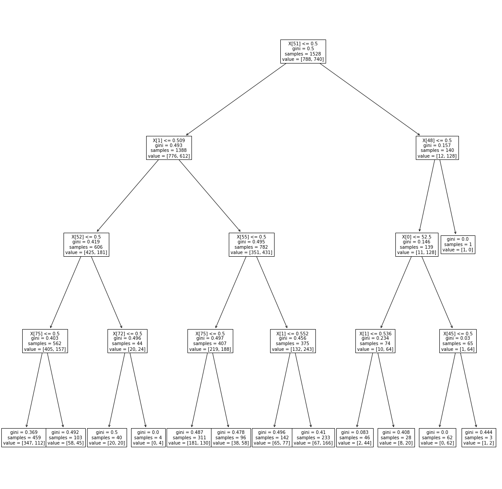

```python
import pandas as pd
import numpy as np
import matplotlib.pyplot as plt

from sklearn.linear_model import LogisticRegression
from sklearn import tree
from sklearn.preprocessing import RobustScaler
from sklearn.model_selection import train_test_split

from sklearn.ensemble import RandomForestClassifier
from sklearn.datasets import make_classification
```


```python
file = open("pew_data.csv")
```


```python
df = pd.read_csv(file)
```


```python
# Delete the index, and remove the repeated vote intention
df_cleaner = df.drop(columns = ["Unnamed: 0","vote16full","votereg","age_top_codes","age4","race3","educ4","name","turnout","vote16"])
df_final = df_cleaner

df_final
```


<div>
<style scoped>
    .dataframe tbody tr th:only-of-type {
        vertical-align: middle;
    }

    .dataframe tbody tr th {
        vertical-align: top;
    }

    .dataframe thead th {
        text-align: right;
    }
</style>
<table border="1" class="dataframe">
  <thead>
    <tr style="text-align: right;">
      <th></th>
      <th>state</th>
      <th>age</th>
      <th>raceeth</th>
      <th>gender</th>
      <th>educ</th>
      <th>weight</th>
      <th>division</th>
      <th>region</th>
      <th>demvote</th>
      <th>obama12</th>
    </tr>
  </thead>
  <tbody>
    <tr>
      <th>0</th>
      <td>MN</td>
      <td>57</td>
      <td>white</td>
      <td>male</td>
      <td>hs grad</td>
      <td>0.731180</td>
      <td>West North Central</td>
      <td>North Central</td>
      <td>0</td>
      <td>0.526523</td>
    </tr>
    <tr>
      <th>1</th>
      <td>DE</td>
      <td>69</td>
      <td>white</td>
      <td>female</td>
      <td>postgrad</td>
      <td>0.442827</td>
      <td>South Atlantic</td>
      <td>South</td>
      <td>1</td>
      <td>0.586064</td>
    </tr>
    <tr>
      <th>2</th>
      <td>DE</td>
      <td>49</td>
      <td>white</td>
      <td>male</td>
      <td>some col</td>
      <td>1.050427</td>
      <td>South Atlantic</td>
      <td>South</td>
      <td>0</td>
      <td>0.586064</td>
    </tr>
    <tr>
      <th>3</th>
      <td>TX</td>
      <td>73</td>
      <td>white</td>
      <td>male</td>
      <td>some col</td>
      <td>0.710583</td>
      <td>West South Central</td>
      <td>South</td>
      <td>0</td>
      <td>0.413834</td>
    </tr>
    <tr>
      <th>4</th>
      <td>CA</td>
      <td>77</td>
      <td>white</td>
      <td>female</td>
      <td>col grad</td>
      <td>0.411932</td>
      <td>Pacific</td>
      <td>West</td>
      <td>1</td>
      <td>0.602390</td>
    </tr>
    <tr>
      <th>...</th>
      <td>...</td>
      <td>...</td>
      <td>...</td>
      <td>...</td>
      <td>...</td>
      <td>...</td>
      <td>...</td>
      <td>...</td>
      <td>...</td>
      <td>...</td>
    </tr>
    <tr>
      <th>1693</th>
      <td>CA</td>
      <td>42</td>
      <td>white</td>
      <td>male</td>
      <td>some col</td>
      <td>1.318183</td>
      <td>Pacific</td>
      <td>West</td>
      <td>1</td>
      <td>0.602390</td>
    </tr>
    <tr>
      <th>1694</th>
      <td>CA</td>
      <td>60</td>
      <td>hispanic</td>
      <td>female</td>
      <td>hs grad</td>
      <td>2.193539</td>
      <td>Pacific</td>
      <td>West</td>
      <td>0</td>
      <td>0.602390</td>
    </tr>
    <tr>
      <th>1695</th>
      <td>IL</td>
      <td>37</td>
      <td>white</td>
      <td>female</td>
      <td>col grad</td>
      <td>1.256393</td>
      <td>East North Central</td>
      <td>North Central</td>
      <td>1</td>
      <td>0.576021</td>
    </tr>
    <tr>
      <th>1696</th>
      <td>WI</td>
      <td>22</td>
      <td>white</td>
      <td>female</td>
      <td>col grad</td>
      <td>0.813566</td>
      <td>East North Central</td>
      <td>North Central</td>
      <td>1</td>
      <td>0.528278</td>
    </tr>
    <tr>
      <th>1697</th>
      <td>CA</td>
      <td>21</td>
      <td>hispanic</td>
      <td>female</td>
      <td>col grad</td>
      <td>0.978339</td>
      <td>Pacific</td>
      <td>West</td>
      <td>1</td>
      <td>0.602390</td>
    </tr>
  </tbody>
</table>
<p>1698 rows × 10 columns</p>
</div>


```python
# We create dummies for all categorical variables
df_first = df_final.drop(columns = ["state","raceeth","gender","division","region","educ","weight"])

df_state = pd.get_dummies(df_final.state, prefix='state')
df_first = df_first.join(df_state,how="outer")

df_raceeth = pd.get_dummies(df_final.raceeth, prefix='raceeth')
df_first = df_first.join(df_raceeth,how="outer")

df_gender = pd.get_dummies(df_final.gender, prefix='gender')
df_first = df_first.join(df_gender,how="outer")

df_division = pd.get_dummies(df_final.division,prefix='division')
df_region = pd.get_dummies(df_final.region,prefix='region')
df_educ = pd.get_dummies(df_final.educ,prefix='educ')

df_first = df_first.join(df_division,how="outer")
df_first = df_first.join(df_region,how="outer")
df_first = df_first.join(df_educ,how="outer")

df_first
```


<div>
<style scoped>
    .dataframe tbody tr th:only-of-type {
        vertical-align: middle;
    }

    .dataframe tbody tr th {
        vertical-align: top;
    }

    .dataframe thead th {
        text-align: right;
    }
</style>
<table border="1" class="dataframe">
  <thead>
    <tr style="text-align: right;">
      <th></th>
      <th>age</th>
      <th>demvote</th>
      <th>obama12</th>
      <th>state_AK</th>
      <th>state_AL</th>
      <th>state_AR</th>
      <th>state_AZ</th>
      <th>state_CA</th>
      <th>state_CO</th>
      <th>state_CT</th>
      <th>...</th>
      <th>region_Northeast</th>
      <th>region_South</th>
      <th>region_West</th>
      <th>educ_assoc</th>
      <th>educ_col grad</th>
      <th>educ_grades 1-8</th>
      <th>educ_hs dropout</th>
      <th>educ_hs grad</th>
      <th>educ_postgrad</th>
      <th>educ_some col</th>
    </tr>
  </thead>
  <tbody>
    <tr>
      <th>0</th>
      <td>57</td>
      <td>0</td>
      <td>0.526523</td>
      <td>0</td>
      <td>0</td>
      <td>0</td>
      <td>0</td>
      <td>0</td>
      <td>0</td>
      <td>0</td>
      <td>...</td>
      <td>0</td>
      <td>0</td>
      <td>0</td>
      <td>0</td>
      <td>0</td>
      <td>0</td>
      <td>0</td>
      <td>1</td>
      <td>0</td>
      <td>0</td>
    </tr>
    <tr>
      <th>1</th>
      <td>69</td>
      <td>1</td>
      <td>0.586064</td>
      <td>0</td>
      <td>0</td>
      <td>0</td>
      <td>0</td>
      <td>0</td>
      <td>0</td>
      <td>0</td>
      <td>...</td>
      <td>0</td>
      <td>1</td>
      <td>0</td>
      <td>0</td>
      <td>0</td>
      <td>0</td>
      <td>0</td>
      <td>0</td>
      <td>1</td>
      <td>0</td>
    </tr>
    <tr>
      <th>2</th>
      <td>49</td>
      <td>0</td>
      <td>0.586064</td>
      <td>0</td>
      <td>0</td>
      <td>0</td>
      <td>0</td>
      <td>0</td>
      <td>0</td>
      <td>0</td>
      <td>...</td>
      <td>0</td>
      <td>1</td>
      <td>0</td>
      <td>0</td>
      <td>0</td>
      <td>0</td>
      <td>0</td>
      <td>0</td>
      <td>0</td>
      <td>1</td>
    </tr>
    <tr>
      <th>3</th>
      <td>73</td>
      <td>0</td>
      <td>0.413834</td>
      <td>0</td>
      <td>0</td>
      <td>0</td>
      <td>0</td>
      <td>0</td>
      <td>0</td>
      <td>0</td>
      <td>...</td>
      <td>0</td>
      <td>1</td>
      <td>0</td>
      <td>0</td>
      <td>0</td>
      <td>0</td>
      <td>0</td>
      <td>0</td>
      <td>0</td>
      <td>1</td>
    </tr>
    <tr>
      <th>4</th>
      <td>77</td>
      <td>1</td>
      <td>0.602390</td>
      <td>0</td>
      <td>0</td>
      <td>0</td>
      <td>0</td>
      <td>1</td>
      <td>0</td>
      <td>0</td>
      <td>...</td>
      <td>0</td>
      <td>0</td>
      <td>1</td>
      <td>0</td>
      <td>1</td>
      <td>0</td>
      <td>0</td>
      <td>0</td>
      <td>0</td>
      <td>0</td>
    </tr>
    <tr>
      <th>...</th>
      <td>...</td>
      <td>...</td>
      <td>...</td>
      <td>...</td>
      <td>...</td>
      <td>...</td>
      <td>...</td>
      <td>...</td>
      <td>...</td>
      <td>...</td>
      <td>...</td>
      <td>...</td>
      <td>...</td>
      <td>...</td>
      <td>...</td>
      <td>...</td>
      <td>...</td>
      <td>...</td>
      <td>...</td>
      <td>...</td>
      <td>...</td>
    </tr>
    <tr>
      <th>1693</th>
      <td>42</td>
      <td>1</td>
      <td>0.602390</td>
      <td>0</td>
      <td>0</td>
      <td>0</td>
      <td>0</td>
      <td>1</td>
      <td>0</td>
      <td>0</td>
      <td>...</td>
      <td>0</td>
      <td>0</td>
      <td>1</td>
      <td>0</td>
      <td>0</td>
      <td>0</td>
      <td>0</td>
      <td>0</td>
      <td>0</td>
      <td>1</td>
    </tr>
    <tr>
      <th>1694</th>
      <td>60</td>
      <td>0</td>
      <td>0.602390</td>
      <td>0</td>
      <td>0</td>
      <td>0</td>
      <td>0</td>
      <td>1</td>
      <td>0</td>
      <td>0</td>
      <td>...</td>
      <td>0</td>
      <td>0</td>
      <td>1</td>
      <td>0</td>
      <td>0</td>
      <td>0</td>
      <td>0</td>
      <td>1</td>
      <td>0</td>
      <td>0</td>
    </tr>
    <tr>
      <th>1695</th>
      <td>37</td>
      <td>1</td>
      <td>0.576021</td>
      <td>0</td>
      <td>0</td>
      <td>0</td>
      <td>0</td>
      <td>0</td>
      <td>0</td>
      <td>0</td>
      <td>...</td>
      <td>0</td>
      <td>0</td>
      <td>0</td>
      <td>0</td>
      <td>1</td>
      <td>0</td>
      <td>0</td>
      <td>0</td>
      <td>0</td>
      <td>0</td>
    </tr>
    <tr>
      <th>1696</th>
      <td>22</td>
      <td>1</td>
      <td>0.528278</td>
      <td>0</td>
      <td>0</td>
      <td>0</td>
      <td>0</td>
      <td>0</td>
      <td>0</td>
      <td>0</td>
      <td>...</td>
      <td>0</td>
      <td>0</td>
      <td>0</td>
      <td>0</td>
      <td>1</td>
      <td>0</td>
      <td>0</td>
      <td>0</td>
      <td>0</td>
      <td>0</td>
    </tr>
    <tr>
      <th>1697</th>
      <td>21</td>
      <td>1</td>
      <td>0.602390</td>
      <td>0</td>
      <td>0</td>
      <td>0</td>
      <td>0</td>
      <td>1</td>
      <td>0</td>
      <td>0</td>
      <td>...</td>
      <td>0</td>
      <td>0</td>
      <td>1</td>
      <td>0</td>
      <td>1</td>
      <td>0</td>
      <td>0</td>
      <td>0</td>
      <td>0</td>
      <td>0</td>
    </tr>
  </tbody>
</table>
<p>1698 rows × 78 columns</p>
</div>


```python
# Separate data into X and y, then we use regression models
df_X = df_first.drop("demvote",axis=1)
list_X_names=df_X.columns
df_Y = df_first.iloc[:,[1]]
Y_name = df_Y.columns
```


```python
# Independent variables are rescaled to make fitting easier
list_X_names=df_X.columns
df_Y = df_Y
Y_name = df_Y.columns

X = df_X.values
Y = df_Y.values
y = Y.reshape(len(Y))

transformer = RobustScaler().fit(X)
x = transformer.transform(X)
x=X

# column names are listed to make interpretation easier
list_X_names
```


    Index(['age', 'obama12', 'state_AK', 'state_AL', 'state_AR', 'state_AZ',
           'state_CA', 'state_CO', 'state_CT', 'state_DC', 'state_DE', 'state_FL',
           'state_GA', 'state_HI', 'state_IA', 'state_ID', 'state_IL', 'state_IN',
           'state_KS', 'state_KY', 'state_LA', 'state_MA', 'state_MD', 'state_ME',
           'state_MI', 'state_MN', 'state_MO', 'state_MS', 'state_NC', 'state_ND',
           'state_NE', 'state_NH', 'state_NJ', 'state_NM', 'state_NV', 'state_NY',
           'state_OH', 'state_OK', 'state_OR', 'state_PA', 'state_RI', 'state_SC',
           'state_TN', 'state_TX', 'state_UT', 'state_VA', 'state_VT', 'state_WA',
           'state_WI', 'state_WV', 'state_WY', 'raceeth_black', 'raceeth_hispanic',
           'raceeth_other', 'raceeth_white', 'gender_female', 'gender_male',
           'division_East North Central', 'division_East South Central',
           'division_Middle Atlantic', 'division_Mountain', 'division_New England',
           'division_Pacific', 'division_South Atlantic',
           'division_West North Central', 'division_West South Central',
           'region_North Central', 'region_Northeast', 'region_South',
           'region_West', 'educ_assoc', 'educ_col grad', 'educ_grades 1-8',
           'educ_hs dropout', 'educ_hs grad', 'educ_postgrad', 'educ_some col'],
          dtype='object')


```python
# data is randomly divided into training and testing sets
X_train, X_test, y_train, y_test = train_test_split(x, y, test_size=0.1, random_state=0)
```


```python
# fit a logistic regression model
regr = LogisticRegression().fit(X_train, y_train)
```

    /Users/zhenyu/opt/anaconda3/lib/python3.7/site-packages/sklearn/linear_model/_logistic.py:940: ConvergenceWarning: lbfgs failed to converge (status=1):
    STOP: TOTAL NO. of ITERATIONS REACHED LIMIT.
    
    Increase the number of iterations (max_iter) or scale the data as shown in:
        https://scikit-learn.org/stable/modules/preprocessing.html
    Please also refer to the documentation for alternative solver options:
        https://scikit-learn.org/stable/modules/linear_model.html#logistic-regression
      extra_warning_msg=_LOGISTIC_SOLVER_CONVERGENCE_MSG)


```python
# training set accuracy of the model
regr.score(X_train,y_train)
```


    0.6910994764397905


```python
# testing set accuracy of the model
regr.score(X_test,y_test)
```


    0.7235294117647059


```python
# regression model parameters can be used to inteprete results
regr.coef_
```


    array([[-0.00285188,  0.7867606 , -0.21851564, -0.59861901,  0.49185163,
            -0.51378412,  0.21065846,  0.1162479 ,  0.1810285 ,  0.23701272,
             0.09833833,  0.23377673, -0.30351827,  0.02371363,  0.63818055,
             0.04125758,  0.21167773, -0.29744938, -0.30765228,  0.35910835,
            -0.3653022 ,  0.06988558,  0.81021783,  0.03010703,  0.46030639,
             0.04253974,  0.17065499, -0.00365229, -0.65174104, -0.33324538,
            -0.13655415,  0.0277683 , -0.09576808,  0.10704084,  0.39073222,
             0.20216012, -0.59162542, -0.20126261, -0.13486151,  0.04956531,
            -0.18873413, -0.18869185,  0.03311127, -0.02732215, -0.26024608,
             0.44010126, -0.07780723,  0.4961368 ,  0.1836391 , -0.61702244,
            -0.09325205,  1.95630355, -0.1080297 , -0.75291073, -0.94517153,
             0.41500125, -0.26480966, -0.03345158, -0.21005168,  0.15595735,
            -0.2120037 ,  0.04224805,  0.37713174,  0.05847328,  0.07392347,
            -0.10203533,  0.04047189,  0.1982054 , -0.25361374,  0.16512804,
            -0.19685443,  0.11748281,  0.96985136, -0.59435212, -0.49601393,
             0.59454873, -0.24447083]])


```python
# fit a decision tree with depth=4
d_tree = tree.DecisionTreeClassifier(max_depth=4)
d_tree = d_tree.fit(X_train,y_train)

# display the fitted decision tree
plt.figure(figsize=(20,20))
tree.plot_tree(d_tree, fontsize=10)
plt.show()
```


    

    


```python
# training set accuracy of the model
d_tree.score(X_train,y_train)
```


    0.680628272251309


```python
# testing set accuracy of the model
d_tree.score(X_test,y_test)
```


    0.6705882352941176


```python
# One thing two models agree on is that being black is the most important
# factor deciding whether or not to vote for clinton

# Logisitic sugguests being racially white or other favors trump,
# while education level being grades 1-8(low) favors clinton

# Regression tree suggests that if one is not black, then the percent
# of people voted for Obama in the state from which the person comes
# is the most important.
# Besides that, post_grad votes more for clinton and hispanic also 
# likes clinton
```


```python
# fit a random forest model with tree number=100 and depth=5
clf = RandomForestClassifier(max_depth=5, random_state=0,n_estimators = 100)
clf.fit(X_train, y_train)
```


    RandomForestClassifier(bootstrap=True, ccp_alpha=0.0, class_weight=None,
                           criterion='gini', max_depth=5, max_features='auto',
                           max_leaf_nodes=None, max_samples=None,
                           min_impurity_decrease=0.0, min_impurity_split=None,
                           min_samples_leaf=1, min_samples_split=2,
                           min_weight_fraction_leaf=0.0, n_estimators=100,
                           n_jobs=None, oob_score=False, random_state=0, verbose=0,
                           warm_start=False)


```python
# training set accuracy of the model
clf.score(X_train,y_train)
```


    0.706151832460733


```python
# testing set accuracy of the model
clf.score(X_test,y_test)
```


    0.6941176470588235


```python
clf.feature_importances_
```


    array([6.09229273e-02, 1.26588100e-01, 7.66888945e-04, 6.31051129e-03,
           1.43670852e-03, 2.52433608e-03, 2.25243127e-02, 1.39079825e-03,
           1.07858467e-03, 2.65323651e-03, 3.77757761e-04, 3.55182896e-03,
           3.84205564e-04, 1.02621899e-03, 1.52670493e-03, 5.81035099e-06,
           3.54345435e-03, 1.44256028e-03, 5.86713093e-04, 6.60993993e-04,
           3.63990169e-03, 8.00689865e-04, 6.86919021e-03, 8.08339345e-04,
           3.27818317e-03, 1.84283501e-03, 2.85365053e-03, 2.79966680e-04,
           5.29313975e-03, 4.92648815e-04, 5.39198265e-04, 3.10279988e-04,
           1.59732718e-03, 6.32561561e-05, 1.21126690e-03, 1.07296993e-02,
           7.52908470e-03, 1.43743877e-03, 2.31997347e-03, 1.22533667e-03,
           1.37053582e-03, 1.87668624e-04, 2.13228892e-03, 6.39304328e-03,
           1.36287914e-03, 2.10916507e-03, 6.09294217e-04, 6.16830566e-03,
           2.62145093e-03, 4.21945177e-03, 0.00000000e+00, 1.90008976e-01,
           1.97427349e-02, 1.05317565e-02, 1.49361903e-01, 4.51651836e-02,
           3.99391443e-02, 4.10661013e-03, 4.80846278e-03, 1.02999424e-02,
           3.04630592e-03, 1.38201846e-03, 4.27723464e-02, 2.32809980e-03,
           3.02182829e-03, 7.23252472e-03, 3.98783183e-03, 1.54025962e-02,
           2.24815058e-02, 9.57798520e-03, 7.73270669e-03, 6.67893334e-03,
           5.29044138e-03, 3.27862326e-03, 1.96985979e-02, 4.49349946e-02,
           7.58980506e-03])


